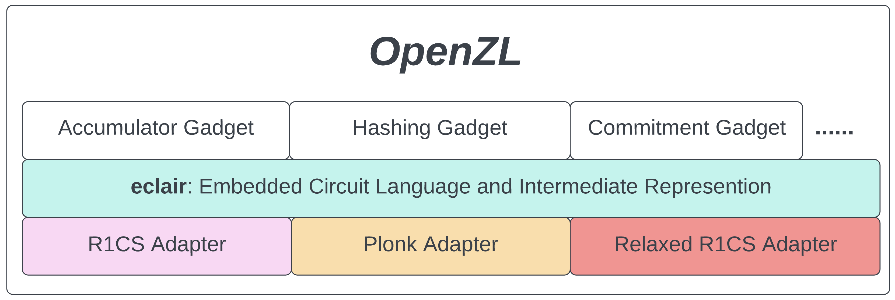

# Introduction

Welcome to OpenZL, the "missing ZKP library."

OpenZL is an open-source library for development of secure, high-performance, zero-knowledge applications. OpenZL aims to bridge the gap between high-level languages that miss valuable opportunities for optimization and low-level libraries that require extensive cryptographic expertise. We believe that bridging this gap can improve both the speed and security of ZK app development.

OpenZL takes a three-tiered approach to the problem: 

### Gadget Layer
The high-level layer provides cryptographic "gadgets" such as accumulators, hash functions, commitment schemes, *etc*. These ready-to-go gadgets are intended for drop-in use in ZK applications. They are composable, allowing complex logic to be built from cryptographic primitives. The gadget library serves developers who want to access ZK without getting in the weeds.

### Plugin Layer
Importantly, OpenZL gadgets make no assumptions about the ZK *proving system* they target. Instead, developers choose an appropriate proof system *plugin* to use whatever proving system works best for their application. These plugins form the low-level layer of OpenZL; this is where nitty-gritty, proof-system-specific optimization occurs.

### Middle Layer: ECLAIR
Between the gadget layer and the proof system layer sits ECLAIR: the *Embedded Circuit Language And Intermediate Representation*. ECLAIR is a proof-system-agnostic language for circuit descriptions. Gadgets written in ECLAIR can target any of the ZK proving systems provided by low-level plugins. OpenZL thus achieves modularity at both the high and low level.

We will have much more to say on ECLAIR in the following chapters. For now, let us just emphasize our goals. We believe that ZK app development should be:

- Fast: both in the sense that developers should be able to quickly start using and composing gadgets and in the sense that those gadgets should be optimized for speed.

- Flexible: as new ZK proving systems appear, developers should be able to quickly adopt the latest technology. We should also de-duplicate the effort required for projects to switch over.
- Secure: you shouldn't have to be an expert cryptographer to build secure applications. We should instead pool our expertise and package it in the form of safe cryptographic libraries.
- Open-source: "NO" to walled gardens! "YES" to collaboration! ***Open***ZL is and will remain open-source.

Please read on to learn more. For now these docs focus on ECLAIR, but we will soon update them with more explanation of the gadget and plugin layers.